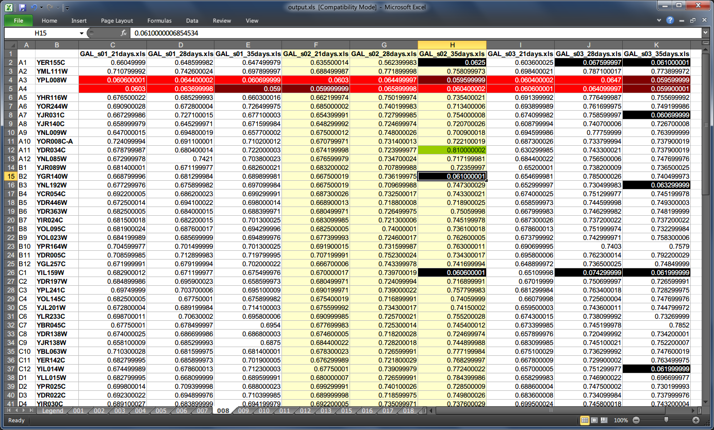

Command Line Interface
======================

Overview
--------

Generating data model in JSON file format can be done with the help of a few Python scripts. If installed correctly the scripts will be recognized and available in the command line without any prefixing. For a graphical user intreface (GUI) wrapper please refer to the next chapter.

By default scripts expect data from standard input and print to the standard output, which allows for combining them in a pipeline. Alternatively intermediate JSON structure can be passed between the scripts through file redirection.

Windows
^^^^^^^

::

    C:\> type input.json | foo.py > output.json

Linux / Mac OS
^^^^^^^^^^^^^^

::

    $ cat input.json | foo.py > output.json

Grouping Tecan® Spreadsheets
----------------------------

When starting from scratch with data collection the first step is to group the original Excel™ file names into a stub JSON structure which represents consecutive experiment iterations. Each iteration is comprised of files and additional metadata. This can be done either manually or using the ``group.py`` script. For convenience you may put spreadsheet files under different folders to take advantage of pipelining, e.g.::

 $ group.py series1/*.xls | group.py series2/*.xls | group.py series3/*.xls

The order of file groups is determined from left to right when calling the script multiple times with a pipe ``|``. Since this will be the entry point of another script you may redirect standard output to a file instead.

This would print the following JSON to the standard output provided that each of the folders contains relevant files::

 [
    {
        "files": [
            "series1/series1_14days.xls",
            "series1/series1_28days.xls",
            "series1/series1_42days.xls",
            "series1/series1_56days.xls"
        ]
    },
    {
        "files": [
            "series2/series2_14days.xls",
            "series2/series2_28days.xls",
            "series2/series2_42days.xls",
            "series2/series2_56days.xls"
        ]
    },
    {
        "files": [
            "series3/series3_14days.xls",
            "series3/series3_28days.xls",
            "series3/series3_42days.xls",
            "series3/series3_56days.xls"
        ]
    }
 ]

Note this is an intermediate structure which is different from the final JSON data model described :ref:`earlier <data-model>`. For example file paths can be relative at this point - they will be resolved into absolute paths at a later stage. Unicode characters and path separators of either type are accepted to achieve portability but non-ASCII characters must be escaped with Unicode NFC escape sequences while backslash with a double `\\\\`.

Custom properties can be defined to annotate groups of files. While not recognized explicitly they are retained and can be accessed later. Example::

 C:\> group.py tecan\*.xls --species "Saccharomyces cerevisiae" --version 3

::

 [
    {
        "files": [
            "tecan\\starvation_collection_7days.xls",
            (...)
        ],
        "species": "Saccharomyces cerevisiae",
        "version": 3
    }
 ]

It is worth noting that the result of calling ``group.py`` as well as many other scripts distributed with microanalyst is simply plain text in JSON format.

Adding Control Wells per Iteration
----------------------------------

.. note::
    This step is optional.

Control wells can be added to all or some iterations by appending a ``control`` property to the intermediate JSON structure. Its contents should conform to the JSON schema outlined before. Example::

 [
    {
        "files": [
            "series1/series1_14days.xls",
            "series1/series1_28days.xls",
            "series1/series1_42days.xls",
            "series1/series1_56days.xls"
        ],
        "control": {
            "002": [
                "A1"
            ],
            "006": [
                "A4", "D5", "E7"
            ]
        }
    },
    (...)
 ]

To automate the process of adding control wells and for greater flexibility control wells can be kept in separate JSON files for each iteration, such as this one:

.. code-block:: javascript

 {
    "002": ["A4"],
    "006": ["A4", "D5", "E7", "F3", "G3", "G8", "H12"],
    "B001": ["H1", "H7"],
    "B002": ["G2", "H5", "H6", "H7", "H8", "H9", "H12"],
    (...)
 }

Then the contents of each of those external JSON files can be quickly pulled in and put under its corresponding iteration by calling the ``control.py`` script::

 C:\> group.py series1/*.xls | group.py series2/*.xls | control.py series1/ctrl.json series2/ctrl.json

The order of this script's parameters determines which iteration to put the control wells into. Note that the number of iterations on the left of the pipeline must be the same as the number of control well files on the right. Otherwise a missing control well file must be indicated with a dash sign to explicitly omit certain iterations, e.g.::

 C:\> (...) | control.py series1/ctrl.json - series3/ctrl.json

Assembling Experiment Data
--------------------------

Up until now the JSON produced by previous scripts or perhaps edited manually merely contained file references and optional metadata. To translate this information into a standalone data model with all samples from Tecan® spreadsheets, e.g. for further processing and analysis, it needs to be assembled. Assembly phase is about reading the original files (without altering them) and putting their contents in a single JSON object according to the schema, while retaining any additional metadata defined inside the iterations of the intermediate JSON. The data is parsed, made uniform and unambiguous (e.g. relative file paths are turned into absolute ones) and optimized for performance.
::

 C:\> (...) | assemble.py > experiment.json

.. code-block:: javascript

 {
    "iterations": [
        {
            "control": {
                "B001": ["H1", "H7"],
                (...)
            },
            "spreadsheets": [
                {
                    "control": {
                        "002": ["A4"],
                        (...)
                    },
                    "filename": "ex2\\series1\\GAL_s01_21days.xls",
                    "microplates": {
                        "001": {
                            "temperature": 23.6,
                            "timestamp": "2014-01-13T12:43:19",
                            "values": [
                                0.7384999990463257,
                                0.7184000015258789,
                                (...)
                            ]
                        },
                        (...)
                    }
                },
                (...)
            ]
        },
        (...)
    ]
 }

The resultant JSON file is the basis for later experiment evaluation.

Adding a Map of Genes
---------------------

Genes are fixed for the entire experiment so they do not belong to any iteration. As a result of that adding genes only makes sense after the assembly phase when the final JSON has a root element ``{}``. Example:

.. code-block:: javascript

 {
    "genes": {
        "001": {
            "A1": "Q0085",
            "A2": "YDR034C-A",
            "A3": "tORF13",
            (...)
        },
        (...)
    },
    "iterations": [
        (...)
    ]
 }

There is a counterpart script to ``control.py`` for including genes in the JSON data model from an external file such as this one:

.. code-block:: javascript

 {
    "001": {
        "A1": "Q0085",
        "A2": "YDR034C-A",
        "A3": "tORF13",
        (...)
    },
    "002": {
        (...)
    },
    (...)
 }

It is called ``genes.py`` and can be used in the following way::

  C:\> type experiment.json | genes.py yeast.json

Note there can be at most one external file with genes since the script overwrites the ``genes`` JSON property with the last file specified.

Quantizing Data Samples
-----------------------

Sometimes it is useful to apply a filtering function on a continuous range of values (such as real numbers) so that they are mapped to a discrete set of values. This can dramatically reduce the complexity of a problem domain. Microanalyst comes with a ``quantize.py`` script which can be used for clustering of data samples measured by a microplate scanner. It recognizes a few types of data samples, based on the metadata provided in the model as well as their actual values, which can be mapped to arbitrary integer numbers. Here they are with the corresponding default values to map to (if not otherwise specified by the user):

+---------+----------------------------------------------+---------------+---------------+-----------+
| Type    | Meaning                                      |    Threshold  |    Argument   | Default   |
+=========+==============================================+===============+===============+===========+
| control | Indicates a possible infection if not empty  |      N/A      | ``--control`` | 2         |
+---------+----------------------------------------------+---------------+---------------+-----------+
| neutral | Living microorganisms (including infection)  |      N/A      | ``--other``   | 1         |
+---------+----------------------------------------------+---------------+---------------+-----------+
| empty   | Dead microorganisms                          |    x <= 0.2   | ``--starved`` | 0         |
+---------+----------------------------------------------+---------------+---------------+-----------+

In spite of being technically possible there is no facility as of now to declaratively override default thresholds for recognizing starved, infected and violated control wells which were mentioned in the introduction.

Custom properties are retained in the result.

If one is only interested in starvation then control and other types of data samples can be disregarded by choosing a common value such as zero for the mapping, while emphasizing empty wells with a different value, e.g. one. This produces a binary view of the experiment, which is very convenient for pattern discovery.
::

 C:\> type experiment.json | quantize.py --control 0 --other 0 --starved 1

.. code-block:: javascript

 {
    "iterations": [
        {
            "spreadsheets": [
                {
                    "filename": "/experiment/series1/series1_14days.xls",
                    "microplates": {
                        "001": {
                            "temperature": 23.3,
                            "timestamp": "2013-04-02T12:47:14",
                            "values": [
                                0,
                                0,
                                1,
                                0,
                                0,
                                0,
                                0,
                                (...)
                            ]
                        },
            (...)
    ]
 }

To invert neutral and empty data sample values but keep the information about control wells::

 C:\> type experiment.json | quantize.py --other 0 --starved 1

Exporting to Microsoft® Excel™
------------------------------

Assembled JSON can be visualized in the form of a spreadsheet with color-coded cells to give you a big picture of experiment data at a glance as well as for quick lookup.

Templates
^^^^^^^^^

There are two templates to choose from, i.e. **horizontal** with each microplate kept in a separate tab and a **vertical** one where all microplates are stored in a single tab. The former can be helpful in individual microplates comparison, whereas the latter in looking for global patterns. The scripts for representing the model with horizontal and vertical layouts are ``xlsh.py`` and ``xlsv.py`` respectively.

Generating visual representation with the horizontal layout from a JSON model could look like this::

 C:\> type experiment.json | xlsh.py output.xls --colors

If the output file already exists it can be forced to be overwritten by specifying the ``-f`` flag.

Genes
^^^^^

Gene names are automatically rendered next to well addresses on pertinent microplates when available in the model.

Colors
^^^^^^

Colors are disabled by default resulting in a less cluttered view. To enable them one must use ``--colors`` boolean flag, which also enables legend rendering (unless binary mode is enabled at the same time with ``--binary`` switch).

Binary mode
^^^^^^^^^^^

Binary mode enhances rendering of binary data samples, i.e. values belonging to ``{0, 1}`` set, by formatting the cells as integers rather than floating-point values. When colors are enabled in binary mode then usual thresholds for detecting different well types (starved, infected, etc.) are disregarded. Instead (a) ones, (b) zeros and (c) the rest of values are color coded.

To make the most out of binary mode one should utilize ``quantize.py`` script in the pipeline::

 C:\> type experiment.json | quantize.py | xlsh.py output.xls --binary --colors

CSS Style
^^^^^^^^^

The default color-coding scheme (shown below) emphasizes zeros in binary mode since these typically manifest some interesting properties. However, if this is not what you want a custom style can be defined with a `CSS <http://en.wikipedia.org/wiki/Cascading_Style_Sheets>`_-like syntax to override part or all of the default stylesheet. A custom CSS file may be loaded with the ``--style`` parameter (ignored if ``--colors`` flag is missing)::

    C:\> type experiment.json | xlsh.py output.xls --colors --style custom.css

To invert the rendering of ones and zeros in binary mode:

.. code-block:: css

 .zero {
 }

 .one {
     background-color: lime;
     color : dark_green;
 }

::

 C:\> type experiment.json |
      quantize.py --control 0 --other 0 --starved 1 |
      xlsh.py output.xls --binary --colors --style invert.css

Default Style
^^^^^^^^^^^^^

.. code-block:: css

    * {
        border-color: gray25;
    }

    .default, .one {
    }

    .alt {
        background-color: ivory;
    }

    .header {
        font-weight: bold;
    }

    .centered, .binary {
        text-align: center;
    }

    .binary {
        number-format: 0;
    }

    .starved, .control, .violated, .other {
        color: white;
    }

    .starved {
        background-color: black;
    }

    .control {
        background-color: dark_red;
    }

    .violated {
        background-color: red;
    }

    .other {
        background-color: red;
    }

    .infected, .zero {
        background-color: lime;
        color : dark_green;
    }